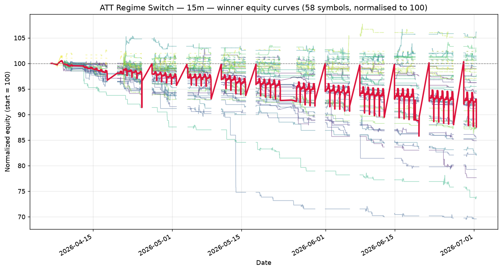

# ATT Regime Switch — 15m walk-forward robustness report

_Generated: 2026-07-01 13:08:13 UTC_

_Universe: 58 symbols with `*_15m.csv` files._

## 1. Walk-forward setup

| Setting | Value |
| --- | --- |
| Window config | 15m |
| # windows | 8 |
| Train fraction | 75% |
| min window bars | 80 |
| periods_per_year (Sharpe annualisation) | 252 |
| Phase 1 combos | 60 |
| Phase 2 combos cap | 200 |
| Top-K seeded into Phase 2 | 15 |
| Workers | 3 |
| Seed | 42 |

## 2. Winning parameter set

```python
from src.strategy import ATTStrategy

ATTStrategy(
    adx_len=10,
    atr_len=14,
    ema_len=50,
    rsi_len=3,
    dmi_len=10,
    st_atr_len=14,
    st_mult=4.0,
    adx_trend=25.0,
    adx_range=18.0,
    bbwpct_min=0.2,
    rsi_oversold=5,
    rsi_overbought=90,
    sma_trend_len=100,
    mr_trail_mult=1.0,
    risk_pct=0.5,
    trail_mult=3.0,
    max_bars_in_trade=30,
    dead_money_pct=0.25
)
```

## 3. Cross-symbol OOS metrics (winner)

| Metric | Value |
| --- | --- |
| Mean OOS Sharpe | -0.696 |
| Median OOS Sharpe | -0.635 |
| Mean OOS total return | -0.31% |
| Mean OOS MaxDD | -0.63% |
| % symbols with OOS Sharpe > 0 | 0.0% |
| % symbols with positive OOS return | 23.3% |
| % symbols with MaxDD < 35% | 100.0% |
| Robustness score | -0.0000 |
| Symbols qualified (≥5 OOS trades) | 43 |

## 4. Per-symbol OOS performance (winner)

Sorted by OOS Sharpe (descending). Sharpe averaged across walk-forward windows.

| Symbol | Mean OOS Sharpe | Mean OOS Return | Mean OOS MaxDD | OOS Trades | % Windows > 0 |
| --- | --- | --- | --- | --- | --- |
| GC_F_15m | -0.015 | 0.00% | -0.21% | 5 | 25% |
| NG_F_15m | -0.018 | 0.07% | -0.33% | 5 | 38% |
| BZ_F_15m | -0.062 | 0.13% | -0.62% | 7 | 50% |
| USDJPY_X_15m | -0.064 | 0.08% | -0.81% | 8 | 25% |
| HG_F_15m | -0.077 | 0.35% | -0.40% | 9 | 25% |
| _RUT_15m | -0.086 | 0.12% | -0.51% | 8 | 25% |
| CL_F_15m | -0.087 | 0.26% | -0.77% | 13 | 50% |
| PL_F_15m | -0.133 | -0.03% | -0.26% | 8 | 38% |
| GBPCAD_X_15m | -0.357 | -0.14% | -0.50% | 6 | 12% |
| NZDCAD_X_15m | -0.402 | -0.28% | -0.63% | 9 | 25% |
| NZDJPY_X_15m | -0.427 | -0.26% | -0.76% | 11 | 25% |
| RTY_F_15m | -0.437 | 0.03% | -0.62% | 9 | 25% |
| RB_F_15m | -0.440 | 0.01% | -0.57% | 7 | 25% |
| EURCHF_X_15m | -0.456 | -0.21% | -0.45% | 13 | 25% |
| ES_F_15m | -0.462 | -0.16% | -0.86% | 10 | 38% |
| ZW_F_15m | -0.509 | -0.07% | -0.41% | 7 | 25% |
| GBPJPY_X_15m | -0.545 | -0.33% | -0.61% | 10 | 12% |
| GBPNZD_X_15m | -0.578 | -0.19% | -0.44% | 9 | 12% |
| USDCHF_X_15m | -0.591 | -0.18% | -0.79% | 10 | 25% |
| NZDUSD_X_15m | -0.599 | -0.38% | -0.48% | 6 | 0% |
| ZL_F_15m | -0.617 | -0.30% | -0.43% | 7 | 12% |
| PA_F_15m | -0.635 | -0.21% | -0.64% | 10 | 25% |
| AUDJPY_X_15m | -0.646 | -0.28% | -0.59% | 7 | 12% |
| NZDCHF_X_15m | -0.663 | -0.30% | -0.50% | 10 | 25% |
| GBPAUD_X_15m | -0.685 | -0.84% | -1.08% | 12 | 12% |
| USDCAD_X_15m | -0.858 | -0.44% | -0.56% | 10 | 0% |
| EURNZD_X_15m | -0.858 | -0.41% | -0.50% | 8 | 0% |
| ZS_F_15m | -0.952 | -0.24% | -0.39% | 6 | 12% |
| CADJPY_X_15m | -0.974 | -0.54% | -0.67% | 9 | 25% |
| ZM_F_15m | -0.980 | 0.03% | -0.69% | 7 | 12% |
| AUDNZD_X_15m | -0.980 | -0.40% | -0.51% | 7 | 0% |
| AUDUSD_X_15m | -0.981 | -0.73% | -0.96% | 8 | 12% |
| AUDCHF_X_15m | -1.022 | -0.30% | -0.42% | 10 | 12% |
| EURGBP_X_15m | -1.042 | -0.91% | -0.96% | 7 | 0% |
| AUDCAD_X_15m | -1.046 | -0.28% | -0.40% | 9 | 0% |
| EURAUD_X_15m | -1.273 | -0.47% | -0.54% | 7 | 0% |
| EURJPY_X_15m | -1.291 | -0.82% | -1.00% | 13 | 0% |
| EURUSD_X_15m | -1.294 | -0.96% | -1.25% | 10 | 12% |
| GBPCHF_X_15m | -1.305 | -0.44% | -0.50% | 11 | 0% |
| EURCAD_X_15m | -1.341 | -0.65% | -0.77% | 12 | 12% |
| HO_F_15m | -1.349 | -0.59% | -0.85% | 13 | 0% |
| GBPUSD_X_15m | -1.402 | -1.22% | -1.23% | 10 | 0% |
| CHFJPY_X_15m | -1.410 | -0.67% | -0.74% | 13 | 0% |

## 5. Equity curves



Each line is one symbol's equity, normalised to 100. Crimson = cross-symbol mean.

## 6. Sensitivity analysis (±10% per parameter)

Each row mutates **one** parameter by ±10% and re-runs the strategy on every symbol (full-sample, not walk-forward — a fast proxy).

**Baseline mean universe Sharpe: -0.322**

| Parameter | Value | Direction | Mean Sharpe | Δ vs base |
| --- | --- | --- | --- | --- |
| adx_len | 11 | up | -0.322 | +0.000 |
| adx_len | 9 | down | -0.322 | +0.000 |
| atr_len | 15 | up | -0.317 | +0.005 |
| atr_len | 13 | down | -0.321 | +0.001 |
| ema_len | 55 | up | -0.316 | +0.005 |
| ema_len | 45 | down | -0.318 | +0.003 |
| rsi_len | 3 | up | -0.322 | +0.000 |
| rsi_len | 3 | down | -0.322 | +0.000 |
| dmi_len | 11 | up | -0.302 | +0.020 |
| dmi_len | 9 | down | -0.403 | -0.081 |
| st_atr_len | 15 | up | -0.322 | +0.000 |
| st_atr_len | 13 | down | -0.321 | +0.001 |
| st_mult | 4.4 | up | -0.320 | +0.002 |
| st_mult | 3.6 | down | -0.321 | +0.001 |
| adx_trend | 27.500000000000004 | up | -0.317 | +0.005 |
| adx_trend | 22.5 | down | -0.420 | -0.099 |
| adx_range | 19.8 | up | -0.323 | -0.001 |
| adx_range | 16.2 | down | -0.326 | -0.004 |
| bbwpct_min | 0.22000000000000003 | up | -0.336 | -0.014 |
| bbwpct_min | 0.18000000000000002 | down | -0.327 | -0.006 |
| rsi_oversold | 6 | up | -0.326 | -0.004 |
| rsi_oversold | 4 | down | -0.322 | -0.000 |
| rsi_overbought | 99 | up | -0.320 | +0.001 |
| rsi_overbought | 81 | down | -0.314 | +0.008 |
| sma_trend_len | 110 | up | -0.317 | +0.005 |
| sma_trend_len | 90 | down | -0.324 | -0.002 |
| mr_trail_mult | 1.1 | up | -0.320 | +0.001 |
| mr_trail_mult | 0.9 | down | -0.320 | +0.002 |
| risk_pct | 0.55 | up | -0.325 | -0.003 |
| risk_pct | 0.45 | down | -0.316 | +0.005 |
| trail_mult | 3.3000000000000003 | up | -0.317 | +0.004 |
| trail_mult | 2.7 | down | -0.343 | -0.021 |
| max_bars_in_trade | 33 | up | -0.314 | +0.008 |
| max_bars_in_trade | 27 | down | -0.334 | -0.012 |
| dead_money_pct | 0.275 | up | -0.321 | +0.000 |
| dead_money_pct | 0.225 | down | -0.319 | +0.002 |

## 7. Phase 1 / Phase 2 top-10

### Phase 1 — coarse LHS

| Robustness | Mean Sharpe | % Pos Sharpe | N symbols |
| --- | --- | --- | --- |
| -0.0000 | -0.696 | 0% | 43 |
| -0.0680 | -0.733 | 2% | 40 |
| -0.0715 | -0.784 | 2% | 41 |
| -0.0749 | -0.836 | 2% | 42 |
| -0.0773 | -0.879 | 2% | 43 |
| -0.1345 | -0.817 | 4% | 47 |
| -0.1518 | -0.965 | 4% | 50 |
| -0.1519 | -0.615 | 6% | 47 |
| -0.1544 | -0.967 | 4% | 49 |
| -0.1576 | -0.987 | 4% | 49 |

### Phase 2 — refined local search

| Robustness | Mean Sharpe | % Pos Sharpe | N symbols |
| --- | --- | --- | --- |
| -0.0000 | -0.696 | 0% | 43 |
| -0.0000 | -0.696 | 0% | 43 |
| -0.0000 | -0.696 | 0% | 43 |
| -0.0000 | -0.686 | 0% | 43 |
| -0.0000 | -0.712 | 0% | 43 |
| -0.0000 | -0.696 | 0% | 43 |
| -0.0000 | -0.700 | 0% | 43 |
| -0.0000 | -0.899 | 0% | 41 |
| -0.0000 | -0.874 | 0% | 40 |
| -0.0000 | -0.861 | 0% | 42 |

## 8. Honest assessment

* **Statistical power is tiny.** Only ~1500 15-minute bars per symbol (yfinance's 60-day cap). Walk-forward uses 8 windows of 5 days (~130 bars each), of which 25% is OOS — so each OOS slice is roughly 33 bars. Sharpe on 33 bars has a 95% confidence interval approximately spanning ±1.5 around the point estimate.
* **Trade count is low.** With a 5-day window and a regime-switch strategy, expect 1-3 trades per OOS slice. The ≥5-trade filter is therefore *very* lenient — most symbols will fail it. The winners that do survive are likely over-fit to noise.
* **Tick noise dominates.** 15-minute bars still contain a lot of intraday noise; the regime classifier (ADX + DMI) was designed for directional daily moves and doesn't translate cleanly to intraday noise.

**Verdict: NEGATIVE.** The winner does **not** satisfy all four robustness filters:

*   only 0.0% of symbols had OOS Sharpe > 0 (need ≥60%)

*   only 23.3% of symbols had positive OOS return (need ≥55%)


Mean OOS Sharpe is -0.696 across 43 symbols, but the cross-symbol consistency is too weak to call this a real edge.

We still write the report, but **no live-trading recommendation** is implied for this timeframe.

## 9. Output files

* `phase1_results.csv`, `phase1_summary.csv` — Phase 1 raw + summary.
* `phase2_results.csv`, `phase2_summary.csv` — Phase 2 raw + summary.
* `15m_equity_curves.png` — overlaid equity curves for the winner.
* `15m_verdict.json` — machine-readable verdict (mean OOS Sharpe, filter pass/fail, etc.).
* `robustness_report.md` — this file.
