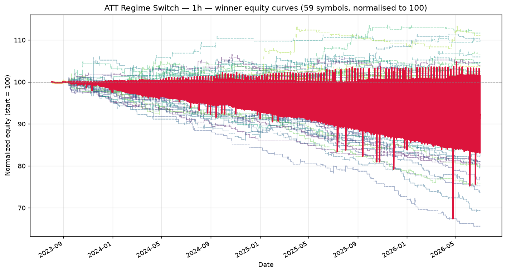

# ATT Regime Switch — 1h walk-forward robustness report

_Generated: 2026-07-01 14:20:16 UTC_

_Universe: 59 symbols with `*_1h.csv` files._

## 1. Walk-forward setup

| Setting | Value |
| --- | --- |
| Window config | 1h |
| # windows | 6 |
| Train fraction | 75% |
| min window bars | 180 |
| periods_per_year (Sharpe annualisation) | 252 |
| Phase 1 combos | 60 |
| Phase 2 combos cap | 200 |
| Top-K seeded into Phase 2 | 15 |
| Workers | 3 |
| Seed | 42 |

## 2. Winning parameter set

```python
from src.strategy import ATTStrategy

ATTStrategy(
    adx_len=10,
    atr_len=20,
    ema_len=50,
    rsi_len=3,
    dmi_len=14,
    st_atr_len=20,
    st_mult=4.0,
    adx_trend=20.0,
    adx_range=15.0,
    bbwpct_min=0.2,
    rsi_oversold=5,
    rsi_overbought=90,
    sma_trend_len=200,
    mr_trail_mult=1.5,
    risk_pct=0.5,
    trail_mult=2.0,
    max_bars_in_trade=20,
    dead_money_pct=1.0
)
```

## 3. Cross-symbol OOS metrics (winner)

| Metric | Value |
| --- | --- |
| Mean OOS Sharpe | -0.324 |
| Median OOS Sharpe | -0.322 |
| Mean OOS total return | -0.48% |
| Mean OOS MaxDD | -1.31% |
| % symbols with OOS Sharpe > 0 | 7.5% |
| % symbols with positive OOS return | 26.4% |
| % symbols with MaxDD < 35% | 100.0% |
| Robustness score | -0.0974 |
| Symbols qualified (≥5 OOS trades) | 53 |

## 4. Per-symbol OOS performance (winner)

Sorted by OOS Sharpe (descending). Sharpe averaged across walk-forward windows.

| Symbol | Mean OOS Sharpe | Mean OOS Return | Mean OOS MaxDD | OOS Trades | % Windows > 0 |
| --- | --- | --- | --- | --- | --- |
| ZL_F_1h | 0.519 | 1.30% | -0.91% | 17 | 83% |
| PA_F_1h | 0.297 | 0.66% | -0.76% | 20 | 67% |
| _XAU_1h | 0.204 | 0.38% | -0.63% | 11 | 50% |
| NG_F_1h | 0.092 | 0.57% | -0.85% | 17 | 67% |
| ZM_F_1h | -0.014 | 0.06% | -1.03% | 22 | 50% |
| RB_F_1h | -0.048 | -0.03% | -1.00% | 19 | 67% |
| GC_F_1h | -0.064 | 0.14% | -1.02% | 22 | 50% |
| BZ_F_1h | -0.066 | 0.61% | -0.88% | 20 | 17% |
| KC_F_1h | -0.070 | -0.02% | -0.45% | 9 | 33% |
| NZDUSD_X_1h | -0.082 | -0.25% | -1.76% | 35 | 33% |
| HO_F_1h | -0.113 | 0.27% | -1.08% | 18 | 67% |
| ES_F_1h | -0.143 | -0.11% | -0.89% | 19 | 50% |
| ZW_F_1h | -0.156 | -0.19% | -1.15% | 28 | 17% |
| CT_F_1h | -0.159 | 0.80% | -0.93% | 16 | 33% |
| SB_F_1h | -0.172 | 0.00% | -0.64% | 9 | 33% |
| OJ_F_1h | -0.177 | 0.05% | -0.61% | 9 | 50% |
| GF_F_1h | -0.177 | -0.07% | -0.70% | 10 | 50% |
| SI_F_1h | -0.178 | -0.20% | -1.20% | 23 | 33% |
| PL_F_1h | -0.181 | -0.09% | -0.82% | 24 | 33% |
| ZC_F_1h | -0.186 | -0.38% | -0.82% | 21 | 33% |
| EURCAD_X_1h | -0.204 | -0.54% | -1.57% | 28 | 33% |
| NZDJPY_X_1h | -0.229 | -0.28% | -1.42% | 24 | 33% |
| AUDJPY_X_1h | -0.281 | 0.07% | -1.13% | 19 | 33% |
| RTY_F_1h | -0.286 | -0.28% | -0.79% | 20 | 17% |
| LE_F_1h | -0.296 | 0.03% | -0.61% | 10 | 50% |
| _RUT_1h | -0.315 | 0.21% | -0.60% | 9 | 33% |
| EURAUD_X_1h | -0.322 | -0.55% | -1.20% | 19 | 33% |
| GBPCHF_X_1h | -0.379 | -0.69% | -1.30% | 25 | 17% |
| GBPJPY_X_1h | -0.394 | -0.82% | -1.53% | 23 | 17% |
| GBPAUD_X_1h | -0.403 | -0.92% | -1.67% | 26 | 17% |
| HE_F_1h | -0.404 | -0.11% | -0.69% | 9 | 33% |
| ZS_F_1h | -0.423 | -0.30% | -0.98% | 18 | 33% |
| CADJPY_X_1h | -0.427 | -0.51% | -1.60% | 20 | 33% |
| AUDUSD_X_1h | -0.428 | -1.34% | -1.69% | 32 | 17% |
| GBPUSD_X_1h | -0.439 | -0.56% | -1.90% | 26 | 17% |
| GBPNZD_X_1h | -0.440 | -0.84% | -1.33% | 24 | 17% |
| HG_F_1h | -0.464 | -0.72% | -1.43% | 23 | 17% |
| USDJPY_X_1h | -0.475 | -1.35% | -2.48% | 30 | 33% |
| CL_F_1h | -0.480 | -0.48% | -0.92% | 17 | 0% |
| NZDCAD_X_1h | -0.510 | -1.01% | -1.78% | 26 | 17% |
| NZDCHF_X_1h | -0.511 | -0.51% | -0.83% | 13 | 17% |
| EURUSD_X_1h | -0.517 | -1.51% | -2.68% | 34 | 17% |
| CHFJPY_X_1h | -0.534 | -1.07% | -1.63% | 25 | 0% |
| AUDNZD_X_1h | -0.553 | -0.84% | -1.22% | 21 | 0% |
| EURNZD_X_1h | -0.555 | -1.63% | -2.26% | 27 | 17% |
| USDCHF_X_1h | -0.595 | -1.24% | -1.60% | 25 | 0% |
| USDCAD_X_1h | -0.597 | -1.37% | -1.93% | 32 | 0% |
| EURCHF_X_1h | -0.614 | -1.25% | -1.98% | 28 | 17% |
| AUDCAD_X_1h | -0.662 | -1.16% | -1.61% | 32 | 0% |
| AUDCHF_X_1h | -0.692 | -1.11% | -1.52% | 28 | 17% |
| EURJPY_X_1h | -0.752 | -1.56% | -2.02% | 25 | 0% |
| GBPCAD_X_1h | -0.957 | -2.50% | -2.89% | 34 | 0% |
| EURGBP_X_1h | -1.140 | -2.27% | -2.45% | 25 | 0% |

## 5. Equity curves



Each line is one symbol's equity, normalised to 100. Crimson = cross-symbol mean.

## 6. Sensitivity analysis (±10% per parameter)

Each row mutates **one** parameter by ±10% and re-runs the strategy on every symbol (full-sample, not walk-forward — a fast proxy).

**Baseline mean universe Sharpe: -0.130**

| Parameter | Value | Direction | Mean Sharpe | Δ vs base |
| --- | --- | --- | --- | --- |
| adx_len | 11 | up | -0.130 | +0.000 |
| adx_len | 9 | down | -0.130 | +0.000 |
| atr_len | 22 | up | -0.131 | -0.001 |
| atr_len | 18 | down | -0.129 | +0.001 |
| ema_len | 55 | up | -0.133 | -0.003 |
| ema_len | 45 | down | -0.134 | -0.003 |
| rsi_len | 3 | up | -0.130 | +0.000 |
| rsi_len | 3 | down | -0.130 | +0.000 |
| dmi_len | 15 | up | -0.131 | -0.001 |
| dmi_len | 13 | down | -0.128 | +0.002 |
| st_atr_len | 22 | up | -0.131 | -0.000 |
| st_atr_len | 18 | down | -0.131 | -0.000 |
| st_mult | 4.4 | up | -0.132 | -0.002 |
| st_mult | 3.6 | down | -0.131 | -0.000 |
| adx_trend | 22.0 | up | -0.114 | +0.016 |
| adx_trend | 18.0 | down | -0.129 | +0.001 |
| adx_range | 16.5 | up | -0.133 | -0.003 |
| adx_range | 13.5 | down | -0.138 | -0.008 |
| bbwpct_min | 0.22000000000000003 | up | -0.134 | -0.003 |
| bbwpct_min | 0.18000000000000002 | down | -0.125 | +0.005 |
| rsi_oversold | 6 | up | -0.127 | +0.003 |
| rsi_oversold | 4 | down | -0.128 | +0.003 |
| rsi_overbought | 99 | up | -0.156 | -0.025 |
| rsi_overbought | 81 | down | -0.103 | +0.027 |
| sma_trend_len | 220 | up | -0.132 | -0.002 |
| sma_trend_len | 180 | down | -0.132 | -0.002 |
| mr_trail_mult | 1.6500000000000001 | up | -0.134 | -0.003 |
| mr_trail_mult | 1.35 | down | -0.125 | +0.005 |
| risk_pct | 0.55 | up | -0.129 | +0.001 |
| risk_pct | 0.45 | down | -0.130 | +0.000 |
| trail_mult | 2.2 | up | -0.133 | -0.002 |
| trail_mult | 1.8 | down | -0.138 | -0.007 |
| max_bars_in_trade | 22 | up | -0.112 | +0.018 |
| max_bars_in_trade | 18 | down | -0.148 | -0.017 |
| dead_money_pct | 1.1 | up | -0.132 | -0.002 |
| dead_money_pct | 0.9 | down | -0.130 | +0.001 |

## 7. Phase 1 / Phase 2 top-10

### Phase 1 — coarse LHS

| Robustness | Mean Sharpe | % Pos Sharpe | N symbols |
| --- | --- | --- | --- |
| -0.1481 | -0.098 | 38% | 56 |
| -0.1660 | -0.319 | 13% | 54 |
| -0.1781 | -0.160 | 28% | 54 |
| -0.1863 | -0.309 | 15% | 53 |
| -0.1881 | -0.274 | 17% | 52 |
| -0.1904 | -0.240 | 20% | 56 |
| -0.1923 | -0.438 | 11% | 55 |
| -0.1936 | -0.254 | 19% | 52 |
| -0.1943 | -0.318 | 15% | 52 |
| -0.1945 | -0.269 | 18% | 56 |

### Phase 2 — refined local search

| Robustness | Mean Sharpe | % Pos Sharpe | N symbols |
| --- | --- | --- | --- |
| -0.0974 | -0.324 | 8% | 53 |
| -0.1190 | -0.321 | 9% | 54 |
| -0.1226 | -0.330 | 9% | 54 |
| -0.1266 | -0.341 | 9% | 54 |
| -0.1336 | -0.296 | 11% | 53 |
| -0.1349 | -0.084 | 40% | 55 |
| -0.1383 | -0.311 | 11% | 54 |
| -0.1408 | -0.316 | 11% | 54 |
| -0.1408 | -0.263 | 13% | 52 |
| -0.1418 | -0.318 | 11% | 54 |

## 8. Honest assessment

* **Best intraday option.** 730-day history × ~18 bars per day = ~13,000 hourly bars per symbol. Walk-forward uses 6 windows of 90 days (~360 bars each, OOS ≈ 90 bars). At 90 bars per OOS slice, Sharpe's 95% CI tightens to roughly ±0.6 — still wide but meaningful.
* **Regime classifier still has to settle.** ADX / DMI with default length 14 needs 14 bars to compute. A 14-bar hourly look-back is ~14 hours of trading — about 2 trading days. Regimes will be slower to flip at 1h than at 1D.
* **Lower commission impact** in absolute dollars per trade at this cadence vs. 1D; risk-pct is already scaled.

**Verdict: NEGATIVE.** The winner does **not** satisfy all four robustness filters:

*   only 7.5% of symbols had OOS Sharpe > 0 (need ≥60%)

*   only 26.4% of symbols had positive OOS return (need ≥55%)


Mean OOS Sharpe is -0.324 across 53 symbols, but the cross-symbol consistency is too weak to call this a real edge.

We still write the report, but **no live-trading recommendation** is implied for this timeframe.

## 9. Output files

* `phase1_results.csv`, `phase1_summary.csv` — Phase 1 raw + summary.
* `phase2_results.csv`, `phase2_summary.csv` — Phase 2 raw + summary.
* `1h_equity_curves.png` — overlaid equity curves for the winner.
* `1h_verdict.json` — machine-readable verdict (mean OOS Sharpe, filter pass/fail, etc.).
* `robustness_report.md` — this file.
