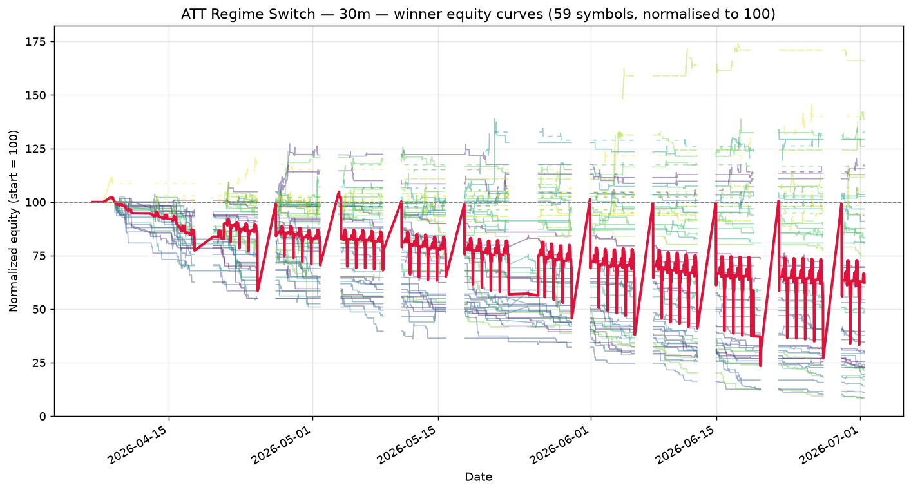

# ATT Regime Switch — 30m walk-forward robustness report

_Generated: 2026-07-01 12:42:12 UTC_

_Universe: 59 symbols with `*_30m.csv` files._

## 1. Walk-forward setup

| Setting | Value |
| --- | --- |
| Window config | 30m |
| # windows | 6 |
| Train fraction | 75% |
| min window bars | 80 |
| periods_per_year (Sharpe annualisation) | 252 |
| Phase 1 combos | 60 |
| Phase 2 combos cap | 200 |
| Top-K seeded into Phase 2 | 15 |
| Workers | 3 |
| Seed | 42 |

## 2. Winning parameter set

```python
from src.strategy import ATTStrategy

ATTStrategy(
    adx_len=20,
    atr_len=10,
    ema_len=50,
    rsi_len=2,
    dmi_len=14,
    st_atr_len=20,
    st_mult=4.0,
    adx_trend=20.0,
    adx_range=20.0,
    bbwpct_min=0.2,
    rsi_oversold=10,
    rsi_overbought=95,
    sma_trend_len=200,
    mr_trail_mult=1.0,
    risk_pct=2.0,
    trail_mult=1.5,
    max_bars_in_trade=10,
    dead_money_pct=1.0
)
```

## 3. Cross-symbol OOS metrics (winner)

| Metric | Value |
| --- | --- |
| Mean OOS Sharpe | -1.110 |
| Median OOS Sharpe | -1.179 |
| Mean OOS total return | -4.00% |
| Mean OOS MaxDD | -4.74% |
| % symbols with OOS Sharpe > 0 | 0.0% |
| % symbols with positive OOS return | 0.0% |
| % symbols with MaxDD < 35% | 100.0% |
| Robustness score | -0.0000 |
| Symbols qualified (≥5 OOS trades) | 28 |

## 4. Per-symbol OOS performance (winner)

Sorted by OOS Sharpe (descending). Sharpe averaged across walk-forward windows.

| Symbol | Mean OOS Sharpe | Mean OOS Return | Mean OOS MaxDD | OOS Trades | % Windows > 0 |
| --- | --- | --- | --- | --- | --- |
| SI_F_30m | -0.067 | -0.02% | -1.41% | 5 | 50% |
| NZDUSD_X_30m | -0.341 | -1.65% | -4.07% | 8 | 0% |
| PL_F_30m | -0.450 | -1.12% | -1.95% | 6 | 17% |
| EURNZD_X_30m | -0.463 | -1.68% | -2.92% | 9 | 17% |
| NZDJPY_X_30m | -0.504 | -3.57% | -4.76% | 11 | 17% |
| NZDCHF_X_30m | -0.508 | -0.78% | -1.26% | 5 | 17% |
| GBPJPY_X_30m | -0.742 | -3.50% | -5.40% | 9 | 17% |
| YM_F_30m | -0.798 | -1.62% | -2.60% | 6 | 17% |
| GBPCHF_X_30m | -0.830 | -1.31% | -2.02% | 5 | 17% |
| RTY_F_30m | -0.893 | -1.70% | -2.00% | 5 | 0% |
| GBPUSD_X_30m | -1.019 | -6.34% | -7.39% | 10 | 0% |
| EURCAD_X_30m | -1.159 | -3.47% | -3.63% | 8 | 0% |
| GC_F_30m | -1.162 | -2.40% | -3.17% | 9 | 17% |
| CHFJPY_X_30m | -1.176 | -2.85% | -2.95% | 7 | 0% |
| GBPAUD_X_30m | -1.182 | -2.85% | -3.24% | 6 | 0% |
| EURCHF_X_30m | -1.211 | -2.57% | -2.86% | 6 | 0% |
| NZDCAD_X_30m | -1.242 | -2.25% | -4.65% | 10 | 17% |
| AUDUSD_X_30m | -1.255 | -5.29% | -5.53% | 8 | 0% |
| EURJPY_X_30m | -1.304 | -6.70% | -6.89% | 8 | 0% |
| GBPNZD_X_30m | -1.445 | -5.60% | -5.85% | 11 | 0% |
| USDCHF_X_30m | -1.477 | -4.39% | -5.00% | 10 | 0% |
| AUDJPY_X_30m | -1.520 | -5.75% | -6.22% | 11 | 0% |
| EURGBP_X_30m | -1.570 | -10.28% | -11.41% | 12 | 0% |
| CADJPY_X_30m | -1.605 | -5.25% | -5.78% | 9 | 0% |
| USDCAD_X_30m | -1.748 | -5.23% | -5.27% | 10 | 0% |
| EURUSD_X_30m | -1.757 | -6.63% | -6.68% | 8 | 0% |
| USDJPY_X_30m | -1.772 | -9.00% | -9.23% | 12 | 0% |
| GBPCAD_X_30m | -1.890 | -8.21% | -8.47% | 13 | 0% |

## 5. Equity curves



Each line is one symbol's equity, normalised to 100. Crimson = cross-symbol mean.

## 6. Sensitivity analysis (±10% per parameter)

Each row mutates **one** parameter by ±10% and re-runs the strategy on every symbol (full-sample, not walk-forward — a fast proxy).

**Baseline mean universe Sharpe: -0.597**

| Parameter | Value | Direction | Mean Sharpe | Δ vs base |
| --- | --- | --- | --- | --- |
| adx_len | 22 | up | -0.597 | +0.000 |
| adx_len | 18 | down | -0.597 | +0.000 |
| atr_len | 11 | up | -0.601 | -0.005 |
| atr_len | 9 | down | -0.597 | -0.001 |
| ema_len | 55 | up | -0.597 | +0.000 |
| ema_len | 45 | down | -0.602 | -0.005 |
| rsi_len | 2 | up | -0.597 | +0.000 |
| rsi_len | 2 | down | -0.597 | +0.000 |
| dmi_len | 15 | up | -0.678 | -0.081 |
| dmi_len | 13 | down | -0.516 | +0.081 |
| st_atr_len | 22 | up | -0.597 | +0.000 |
| st_atr_len | 18 | down | -0.597 | +0.000 |
| st_mult | 4.4 | up | -0.597 | +0.000 |
| st_mult | 3.6 | down | -0.596 | +0.001 |
| adx_trend | 22.0 | up | -0.596 | +0.001 |
| adx_trend | 18.0 | down | -0.717 | -0.121 |
| adx_range | 22.0 | up | -0.809 | -0.213 |
| adx_range | 18.0 | down | -0.557 | +0.040 |
| bbwpct_min | 0.22000000000000003 | up | -0.586 | +0.011 |
| bbwpct_min | 0.18000000000000002 | down | -0.608 | -0.012 |
| rsi_oversold | 11 | up | -0.616 | -0.020 |
| rsi_oversold | 9 | down | -0.581 | +0.016 |
| rsi_overbought | 105 | up | -0.629 | -0.032 |
| rsi_overbought | 86 | down | -0.632 | -0.035 |
| sma_trend_len | 220 | up | -0.621 | -0.024 |
| sma_trend_len | 180 | down | -0.568 | +0.029 |
| mr_trail_mult | 1.1 | up | -0.600 | -0.004 |
| mr_trail_mult | 0.9 | down | -0.612 | -0.015 |
| risk_pct | 2.2 | up | -0.600 | -0.004 |
| risk_pct | 1.8 | down | -0.594 | +0.003 |
| trail_mult | 1.6500000000000001 | up | -0.604 | -0.007 |
| trail_mult | 1.35 | down | -0.583 | +0.013 |
| max_bars_in_trade | 11 | up | -0.571 | +0.025 |
| max_bars_in_trade | 9 | down | -0.630 | -0.034 |
| dead_money_pct | 1.1 | up | -0.594 | +0.003 |
| dead_money_pct | 0.9 | down | -0.603 | -0.006 |

## 7. Phase 1 / Phase 2 top-10

### Phase 1 — coarse LHS

| Robustness | Mean Sharpe | % Pos Sharpe | N symbols |
| --- | --- | --- | --- |
| -0.0000 | -0.992 | 0% | 28 |
| -0.0000 | -0.756 | 0% | 22 |
| -0.0000 | -0.798 | 0% | 25 |
| -0.0000 | -1.045 | 0% | 23 |
| -0.0000 | -0.872 | 0% | 24 |
| -0.0000 | -1.003 | 0% | 26 |
| -0.0000 | -0.855 | 0% | 25 |
| -0.0000 | -1.110 | 0% | 28 |
| -0.0000 | -0.660 | 0% | 15 |
| -0.0000 | -0.640 | 0% | 20 |

### Phase 2 — refined local search

| Robustness | Mean Sharpe | % Pos Sharpe | N symbols |
| --- | --- | --- | --- |
| -0.0000 | -1.110 | 0% | 28 |
| -0.0000 | -1.119 | 0% | 28 |
| -0.0000 | -1.189 | 0% | 26 |
| -0.0000 | -1.131 | 0% | 28 |
| -0.0000 | -0.921 | 0% | 26 |
| -0.0000 | -1.146 | 0% | 29 |
| -0.0000 | -1.110 | 0% | 28 |
| -0.0000 | -1.102 | 0% | 28 |
| -0.0000 | -1.116 | 0% | 28 |
| -0.0000 | -1.048 | 0% | 28 |

## 8. Honest assessment

* **Same statistical-power issue as 15m.** Even less data per walk-forward window (10 days × ~13 bars/day = 130 bars, OOS ≈ 32 bars).
* **Slightly less noise than 15m** but the regime classifier still needs multiple bars to settle into a 'bull / bear / range' classification, and ADX needs ~14 bars of buildup.

**Verdict: NEGATIVE.** The winner does **not** satisfy all four robustness filters:

*   only 0.0% of symbols had OOS Sharpe > 0 (need ≥60%)

*   only 0.0% of symbols had positive OOS return (need ≥55%)


Mean OOS Sharpe is -1.110 across 28 symbols, but the cross-symbol consistency is too weak to call this a real edge.

We still write the report, but **no live-trading recommendation** is implied for this timeframe.

## 9. Output files

* `phase1_results.csv`, `phase1_summary.csv` — Phase 1 raw + summary.
* `phase2_results.csv`, `phase2_summary.csv` — Phase 2 raw + summary.
* `30m_equity_curves.png` — overlaid equity curves for the winner.
* `30m_verdict.json` — machine-readable verdict (mean OOS Sharpe, filter pass/fail, etc.).
* `robustness_report.md` — this file.
