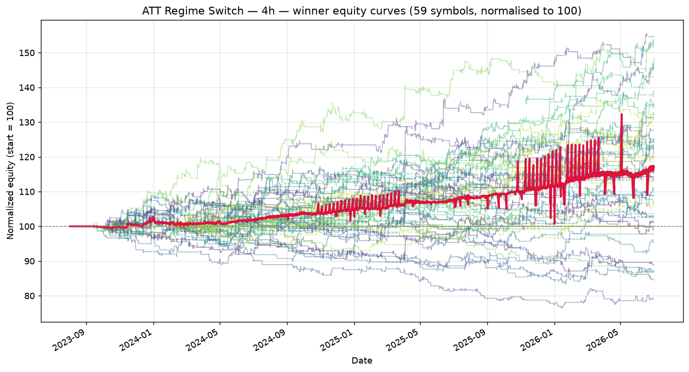

# ATT Regime Switch — 4h walk-forward robustness report

_Generated: 2026-07-01 12:16:50 UTC_

_Universe: 59 symbols with `*_4h.csv` files._

## 1. Walk-forward setup

| Setting | Value |
| --- | --- |
| Window config | 4h |
| # windows | 4 |
| Train fraction | 75% |
| min window bars | 120 |
| periods_per_year (Sharpe annualisation) | 252 |
| Phase 1 combos | 60 |
| Phase 2 combos cap | 200 |
| Top-K seeded into Phase 2 | 15 |
| Workers | 3 |
| Seed | 42 |

## 2. Winning parameter set

```python
from src.strategy import ATTStrategy

ATTStrategy(
    adx_len=20,
    atr_len=14,
    ema_len=100,
    rsi_len=2,
    dmi_len=20,
    st_atr_len=14,
    st_mult=2.0,
    adx_trend=30.0,
    adx_range=20.0,
    bbwpct_min=0.05,
    rsi_oversold=10,
    rsi_overbought=85,
    sma_trend_len=200,
    mr_trail_mult=2.0,
    risk_pct=1.0,
    trail_mult=1.5,
    max_bars_in_trade=30,
    dead_money_pct=0.25
)
```

## 3. Cross-symbol OOS metrics (winner)

| Metric | Value |
| --- | --- |
| Mean OOS Sharpe | 0.138 |
| Median OOS Sharpe | 0.115 |
| Mean OOS total return | 0.71% |
| Mean OOS MaxDD | -1.95% |
| % symbols with OOS Sharpe > 0 | 60.9% |
| % symbols with positive OOS return | 63.0% |
| % symbols with MaxDD < 35% | 100.0% |
| Robustness score | 0.3223 |
| Symbols qualified (≥5 OOS trades) | 46 |

## 4. Per-symbol OOS performance (winner)

Sorted by OOS Sharpe (descending). Sharpe averaged across walk-forward windows.

| Symbol | Mean OOS Sharpe | Mean OOS Return | Mean OOS MaxDD | OOS Trades | % Windows > 0 |
| --- | --- | --- | --- | --- | --- |
| ZC_F_4h | 1.429 | 3.12% | -1.07% | 14 | 75% |
| RB_F_4h | 1.389 | 4.61% | -1.18% | 15 | 75% |
| CL_F_4h | 1.077 | 2.29% | -1.29% | 13 | 75% |
| GC_F_4h | 1.064 | 1.90% | -0.41% | 6 | 75% |
| NG_F_4h | 1.051 | 2.46% | -1.14% | 14 | 100% |
| ZM_F_4h | 0.811 | 1.25% | -1.26% | 14 | 100% |
| EURJPY_X_4h | 0.750 | 2.99% | -2.49% | 20 | 75% |
| _RUT_4h | 0.688 | 0.76% | -0.47% | 6 | 50% |
| HO_F_4h | 0.682 | 1.91% | -1.46% | 17 | 75% |
| ZS_F_4h | 0.651 | 1.70% | -1.32% | 14 | 75% |
| EURUSD_X_4h | 0.648 | 3.63% | -2.06% | 25 | 50% |
| EURAUD_X_4h | 0.553 | 1.45% | -2.57% | 17 | 50% |
| PL_F_4h | 0.548 | 1.91% | -1.25% | 19 | 75% |
| GBPUSD_X_4h | 0.466 | 3.27% | -2.70% | 25 | 75% |
| HG_F_4h | 0.342 | 1.67% | -1.81% | 16 | 50% |
| PA_F_4h | 0.327 | 0.84% | -1.15% | 14 | 75% |
| SI_F_4h | 0.300 | 2.39% | -1.63% | 12 | 50% |
| ZW_F_4h | 0.299 | 1.48% | -1.22% | 11 | 50% |
| EURCHF_X_4h | 0.251 | 0.65% | -1.69% | 18 | 50% |
| USDJPY_X_4h | 0.221 | 1.15% | -2.77% | 18 | 50% |
| NZDUSD_X_4h | 0.210 | 0.82% | -2.02% | 15 | 50% |
| SB_F_4h | 0.175 | 0.45% | -0.71% | 6 | 50% |
| USDCAD_X_4h | 0.137 | 0.72% | -2.63% | 19 | 50% |
| CHFJPY_X_4h | 0.092 | 0.62% | -2.68% | 22 | 50% |
| AUDCAD_X_4h | 0.065 | 0.43% | -1.50% | 13 | 50% |
| GBPCHF_X_4h | 0.040 | 0.74% | -1.30% | 11 | 50% |
| BZ_F_4h | 0.035 | 0.60% | -1.15% | 9 | 25% |
| GBPAUD_X_4h | 0.034 | 0.72% | -2.10% | 16 | 50% |
| CADJPY_X_4h | -0.027 | 0.22% | -2.83% | 18 | 50% |
| EURNZD_X_4h | -0.145 | -0.26% | -2.67% | 20 | 50% |
| NZDCAD_X_4h | -0.188 | -0.45% | -3.23% | 25 | 25% |
| AUDUSD_X_4h | -0.241 | -0.14% | -2.67% | 20 | 25% |
| GBPJPY_X_4h | -0.249 | -0.46% | -3.02% | 19 | 50% |
| ES_F_4h | -0.252 | -0.25% | -1.71% | 16 | 25% |
| AUDCHF_X_4h | -0.264 | -0.57% | -2.11% | 19 | 25% |
| GBPNZD_X_4h | -0.345 | -0.03% | -2.16% | 15 | 50% |
| AUDJPY_X_4h | -0.351 | -0.97% | -2.96% | 21 | 50% |
| CT_F_4h | -0.383 | -0.69% | -1.60% | 13 | 25% |
| ZL_F_4h | -0.412 | -0.34% | -0.76% | 6 | 25% |
| GBPCAD_X_4h | -0.434 | -0.45% | -2.56% | 14 | 25% |
| USDCHF_X_4h | -0.458 | -0.78% | -3.02% | 24 | 50% |
| NZDJPY_X_4h | -0.478 | -1.17% | -2.69% | 18 | 0% |
| RTY_F_4h | -0.603 | -1.04% | -2.69% | 18 | 25% |
| AUDNZD_X_4h | -0.870 | -1.60% | -1.87% | 12 | 0% |
| EURGBP_X_4h | -1.075 | -2.68% | -3.04% | 17 | 0% |
| EURCAD_X_4h | -1.233 | -2.17% | -2.91% | 23 | 0% |

## 5. Equity curves



Each line is one symbol's equity, normalised to 100. Crimson = cross-symbol mean.

## 6. Sensitivity analysis (±10% per parameter)

Each row mutates **one** parameter by ±10% and re-runs the strategy on every symbol (full-sample, not walk-forward — a fast proxy).

**Baseline mean universe Sharpe: 0.403**

| Parameter | Value | Direction | Mean Sharpe | Δ vs base |
| --- | --- | --- | --- | --- |
| adx_len | 22 | up | 0.403 | +0.000 |
| adx_len | 18 | down | 0.403 | +0.000 |
| atr_len | 15 | up | 0.403 | +0.000 |
| atr_len | 13 | down | 0.401 | -0.001 |
| ema_len | 110 | up | 0.403 | +0.001 |
| ema_len | 90 | down | 0.403 | +0.000 |
| rsi_len | 2 | up | 0.403 | +0.000 |
| rsi_len | 2 | down | 0.403 | +0.000 |
| dmi_len | 22 | up | 0.407 | +0.004 |
| dmi_len | 18 | down | 0.368 | -0.035 |
| st_atr_len | 15 | up | 0.403 | +0.000 |
| st_atr_len | 13 | down | 0.403 | +0.000 |
| st_mult | 2.2 | up | 0.403 | +0.000 |
| st_mult | 1.8 | down | 0.403 | -0.000 |
| adx_trend | 33.0 | up | 0.398 | -0.005 |
| adx_trend | 27.0 | down | 0.400 | -0.003 |
| adx_range | 22.0 | up | 0.422 | +0.019 |
| adx_range | 18.0 | down | 0.340 | -0.063 |
| bbwpct_min | 0.05500000000000001 | up | 0.401 | -0.001 |
| bbwpct_min | 0.045000000000000005 | down | 0.403 | +0.000 |
| rsi_oversold | 11 | up | 0.407 | +0.005 |
| rsi_oversold | 9 | down | 0.392 | -0.010 |
| rsi_overbought | 94 | up | 0.298 | -0.105 |
| rsi_overbought | 76 | down | 0.452 | +0.049 |
| sma_trend_len | 220 | up | 0.411 | +0.009 |
| sma_trend_len | 180 | down | 0.393 | -0.010 |
| mr_trail_mult | 2.2 | up | 0.397 | -0.006 |
| mr_trail_mult | 1.8 | down | 0.408 | +0.006 |
| risk_pct | 1.1 | up | 0.405 | +0.002 |
| risk_pct | 0.9 | down | 0.404 | +0.001 |
| trail_mult | 1.6500000000000001 | up | 0.377 | -0.025 |
| trail_mult | 1.35 | down | 0.438 | +0.036 |
| max_bars_in_trade | 33 | up | 0.404 | +0.001 |
| max_bars_in_trade | 27 | down | 0.401 | -0.002 |
| dead_money_pct | 0.275 | up | 0.403 | +0.000 |
| dead_money_pct | 0.225 | down | 0.404 | +0.001 |

## 7. Phase 1 / Phase 2 top-10

### Phase 1 — coarse LHS

| Robustness | Mean Sharpe | % Pos Sharpe | N symbols |
| --- | --- | --- | --- |
| 0.0565 | 0.027 | 53% | 49 |
| 0.0549 | 0.031 | 44% | 52 |
| -0.0639 | -0.034 | 50% | 42 |
| -0.1042 | -0.061 | 43% | 51 |
| -0.1240 | -0.277 | 13% | 31 |
| -0.1344 | -0.382 | 10% | 29 |
| -0.1523 | -0.162 | 28% | 29 |
| -0.1620 | -0.161 | 26% | 46 |
| -0.1754 | -0.139 | 42% | 19 |
| -0.1781 | -0.351 | 15% | 26 |

### Phase 2 — refined local search

| Robustness | Mean Sharpe | % Pos Sharpe | N symbols |
| --- | --- | --- | --- |
| 0.3430 | 0.150 | 58% | 52 |
| 0.3223 | 0.138 | 61% | 46 |
| 0.1514 | 0.079 | 48% | 52 |
| 0.1227 | 0.057 | 54% | 52 |
| 0.1190 | 0.052 | 58% | 48 |
| 0.1135 | 0.055 | 53% | 49 |
| 0.1076 | 0.052 | 56% | 39 |
| 0.0933 | 0.043 | 57% | 46 |
| 0.0883 | 0.045 | 50% | 50 |
| 0.0877 | 0.049 | 44% | 54 |

## 8. Honest assessment

* **Built from 1h by resampling.** Total bar count is small (~1200 4h bars per symbol). Walk-forward uses 4 windows of 180 days (~180 bars each, OOS ≈ 45 bars).
* **Bars include all hours** (no market-hours filter), so a 4h bar may span a quiet pre-market period followed by the open — introducing some intraday-structure noise.
* **Most bars but fewer trades** — the regime filter requires ADX / DMI to stabilise, and 4h ADX is sluggish.

**Verdict: PASS (with caveats).** The winner satisfies all four robustness filters (OOS Sharpe > 0 on ≥60% of symbols, MaxDD < 35% on ≥70%, positive OOS return on ≥55%, ≥5 qualified symbols).

Mean OOS Sharpe across 46 symbols is 0.138.

Caveats: see the per-TF notes above for statistical-power warnings.

## 9. Output files

* `phase1_results.csv`, `phase1_summary.csv` — Phase 1 raw + summary.
* `phase2_results.csv`, `phase2_summary.csv` — Phase 2 raw + summary.
* `4h_equity_curves.png` — overlaid equity curves for the winner.
* `4h_verdict.json` — machine-readable verdict (mean OOS Sharpe, filter pass/fail, etc.).
* `robustness_report.md` — this file.
