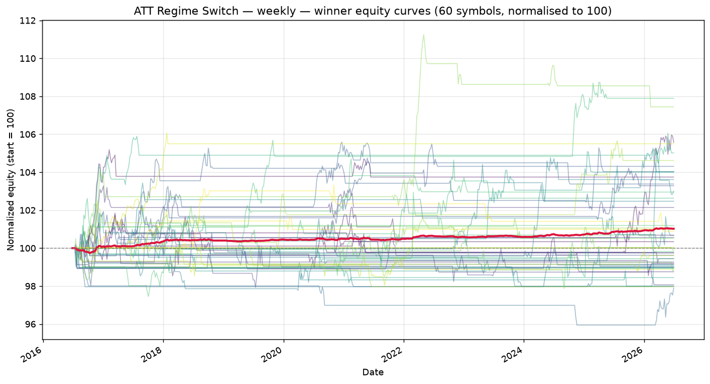

# ATT Regime Switch — weekly walk-forward robustness report

_Generated: 2026-07-01 12:25:36 UTC_

_Universe: 60 symbols with `*_weekly.csv` files._

## 1. Walk-forward setup

| Setting | Value |
| --- | --- |
| Window config | weekly |
| # windows | 4 |
| Train fraction | 75% |
| min window bars | 60 |
| periods_per_year (Sharpe annualisation) | 52 |
| Phase 1 combos | 60 |
| Phase 2 combos cap | 200 |
| Top-K seeded into Phase 2 | 15 |
| Workers | 2 |
| Seed | 42 |

## 2. Winning parameter set

```python
from src.strategy import ATTStrategy

ATTStrategy(
    adx_len=10,
    atr_len=20,
    ema_len=100,
    rsi_len=3,
    dmi_len=10,
    st_atr_len=14,
    st_mult=4.0,
    adx_trend=25.0,
    adx_range=18.0,
    bbwpct_min=0.2,
    rsi_oversold=5,
    rsi_overbought=85,
    sma_trend_len=200,
    mr_trail_mult=1.5,
    risk_pct=1.0,
    trail_mult=1.5,
    max_bars_in_trade=20,
    dead_money_pct=0.25
)
```

## 3. Cross-symbol OOS metrics (winner)

| Metric | Value |
| --- | --- |
| Mean OOS Sharpe | 0.357 |
| Median OOS Sharpe | 0.425 |
| Mean OOS total return | 1.35% |
| Mean OOS MaxDD | -1.00% |
| % symbols with OOS Sharpe > 0 | 71.4% |
| % symbols with positive OOS return | 71.4% |
| % symbols with MaxDD < 35% | 100.0% |
| Robustness score | 0.5295 |
| Symbols qualified (≥5 OOS trades) | 7 |

## 4. Per-symbol OOS performance (winner)

Sorted by OOS Sharpe (descending). Sharpe averaged across walk-forward windows.

| Symbol | Mean OOS Sharpe | Mean OOS Return | Mean OOS MaxDD | OOS Trades | % Windows > 0 |
| --- | --- | --- | --- | --- | --- |
| BZ_F_weekly | 1.089 | 3.19% | -1.05% | 5 | 75% |
| HO_F_weekly | 0.826 | 1.47% | -1.07% | 5 | 75% |
| ZC_F_weekly | 0.536 | 4.19% | -1.12% | 5 | 50% |
| NZDJPY_X_weekly | 0.425 | 1.02% | -0.82% | 5 | 75% |
| EURNZD_X_weekly | 0.268 | 0.50% | -0.85% | 5 | 75% |
| EURGBP_X_weekly | -0.181 | -0.36% | -1.15% | 6 | 0% |
| NZDCAD_X_weekly | -0.466 | -0.53% | -0.98% | 5 | 25% |

## 5. Equity curves



Each line is one symbol's equity, normalised to 100. Crimson = cross-symbol mean.

## 6. Sensitivity analysis (±10% per parameter)

Each row mutates **one** parameter by ±10% and re-runs the strategy on every symbol (full-sample, not walk-forward — a fast proxy).

**Baseline mean universe Sharpe: 0.062**

| Parameter | Value | Direction | Mean Sharpe | Δ vs base |
| --- | --- | --- | --- | --- |
| adx_len | 11 | up | 0.062 | +0.000 |
| adx_len | 9 | down | 0.062 | +0.000 |
| atr_len | 22 | up | 0.059 | -0.003 |
| atr_len | 18 | down | 0.058 | -0.004 |
| ema_len | 110 | up | 0.063 | +0.001 |
| ema_len | 90 | down | 0.064 | +0.002 |
| rsi_len | 3 | up | 0.062 | +0.000 |
| rsi_len | 3 | down | 0.062 | +0.000 |
| dmi_len | 11 | up | 0.080 | +0.019 |
| dmi_len | 9 | down | 0.092 | +0.030 |
| st_atr_len | 15 | up | 0.062 | +0.000 |
| st_atr_len | 13 | down | 0.062 | +0.000 |
| st_mult | 4.4 | up | 0.062 | +0.000 |
| st_mult | 3.6 | down | 0.062 | +0.000 |
| adx_trend | 27.500000000000004 | up | 0.029 | -0.033 |
| adx_trend | 22.5 | down | 0.078 | +0.016 |
| adx_range | 19.8 | up | 0.063 | +0.001 |
| adx_range | 16.2 | down | 0.047 | -0.015 |
| bbwpct_min | 0.22000000000000003 | up | 0.066 | +0.004 |
| bbwpct_min | 0.18000000000000002 | down | 0.066 | +0.004 |
| rsi_oversold | 6 | up | 0.062 | +0.000 |
| rsi_oversold | 4 | down | 0.063 | +0.001 |
| rsi_overbought | 94 | up | 0.047 | -0.015 |
| rsi_overbought | 76 | down | 0.099 | +0.037 |
| sma_trend_len | 220 | up | 0.062 | +0.000 |
| sma_trend_len | 180 | down | 0.063 | +0.001 |
| mr_trail_mult | 1.6500000000000001 | up | 0.059 | -0.003 |
| mr_trail_mult | 1.35 | down | 0.066 | +0.004 |
| risk_pct | 1.1 | up | 0.077 | +0.015 |
| risk_pct | 0.9 | down | 0.059 | -0.003 |
| trail_mult | 1.6500000000000001 | up | 0.049 | -0.013 |
| trail_mult | 1.35 | down | 0.071 | +0.009 |
| max_bars_in_trade | 22 | up | 0.061 | -0.001 |
| max_bars_in_trade | 18 | down | 0.062 | -0.000 |
| dead_money_pct | 0.275 | up | 0.062 | +0.000 |
| dead_money_pct | 0.225 | down | 0.061 | -0.001 |

## 7. Phase 1 / Phase 2 top-10

### Phase 1 — coarse LHS

| Robustness | Mean Sharpe | % Pos Sharpe | N symbols |
| --- | --- | --- | --- |
| 0.4147 | 0.449 | 67% | 3 |
| 0.3154 | 0.455 | 100% | 1 |
| 0.2958 | 0.427 | 100% | 1 |
| 0.2443 | 0.178 | 62% | 8 |
| 0.2143 | 0.232 | 67% | 3 |
| 0.1782 | 0.119 | 58% | 12 |
| 0.1772 | 0.125 | 54% | 13 |
| 0.1725 | 0.086 | 56% | 36 |
| 0.0498 | 0.091 | 50% | 2 |
| 0.0225 | 0.041 | 50% | 2 |

### Phase 2 — refined local search

| Robustness | Mean Sharpe | % Pos Sharpe | N symbols |
| --- | --- | --- | --- |
| 0.7714 | 0.479 | 100% | 4 |
| 0.5959 | 0.494 | 75% | 4 |
| 0.5295 | 0.357 | 71% | 7 |
| 0.4588 | 0.662 | 100% | 1 |
| 0.4306 | 0.621 | 100% | 1 |
| 0.4239 | 0.459 | 67% | 3 |
| 0.4199 | 0.454 | 67% | 3 |
| 0.4147 | 0.449 | 67% | 3 |
| 0.4147 | 0.449 | 67% | 3 |
| 0.4147 | 0.449 | 67% | 3 |

## 8. Honest assessment

* **Most comparable to the 1D/4y study.** 10 years of weekly bars = ~520 bars per symbol. Walk-forward uses 4 windows of 2 years (~104 bars each, OOS ≈ 26 bars).
* **Sharpe confidence intervals at 26 bars** are wide (~±1.5), but the absolute number of bars is the same order of magnitude as the 1D study's OOS slices.
* **Less overfitting pressure** — fewer bars means fewer distinct trade setups to fit against.

**Verdict: PASS (with caveats).** The winner satisfies all four robustness filters (OOS Sharpe > 0 on ≥60% of symbols, MaxDD < 35% on ≥70%, positive OOS return on ≥55%, ≥5 qualified symbols).

Mean OOS Sharpe across 7 symbols is 0.357.

Caveats: see the per-TF notes above for statistical-power warnings.

## 9. Output files

* `phase1_results.csv`, `phase1_summary.csv` — Phase 1 raw + summary.
* `phase2_results.csv`, `phase2_summary.csv` — Phase 2 raw + summary.
* `weekly_equity_curves.png` — overlaid equity curves for the winner.
* `weekly_verdict.json` — machine-readable verdict (mean OOS Sharpe, filter pass/fail, etc.).
* `robustness_report.md` — this file.
