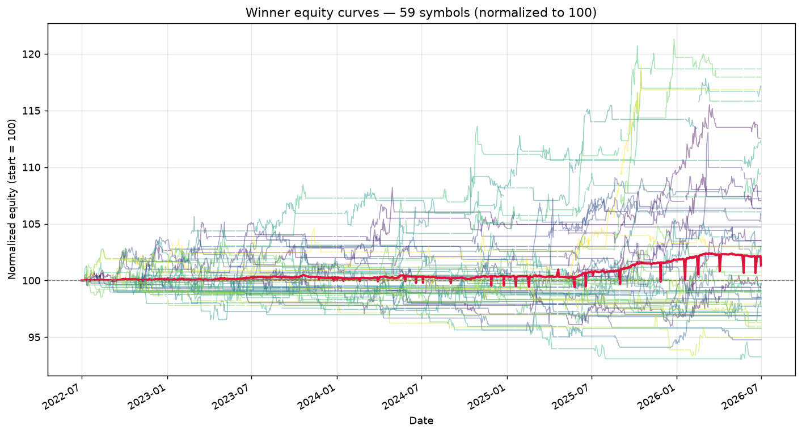

# ATT Regime Switch — Walk-Forward Robustness Report

_Generated: 2026-07-01 07:39:31 UTC_

_Symbols evaluated: **5** / 59 available (filter: ≥5 OOS trades)_

## 1. Winning parameter set

```python
from src.strategy import ATTStrategy

ATTStrategy(
    adx_len=14,
    atr_len=20,
    ema_len=100,
    rsi_len=2,
    dmi_len=10,
    st_atr_len=20,
    st_mult=3.0,
    adx_trend=30.0,
    adx_range=18.0,
    bbwpct_min=0.1,
    rsi_oversold=15,
    rsi_overbought=90,
    sma_trend_len=100,
    mr_trail_mult=1.5,
    risk_pct=1.0,
    trail_mult=2.0,
    max_bars_in_trade=20,
    dead_money_pct=0.25
)
```

## 2. Cross-symbol OOS metrics (winner)

| Metric | Value |
| --- | --- |
| Mean OOS Sharpe | 0.728 |
| Median OOS Sharpe | 0.940 |
| Mean OOS total return | 1.17% |
| Mean OOS MaxDD | -1.06% |
| % symbols with OOS Sharpe > 0 | 80.0% |
| % symbols with positive OOS return | 80.0% |
| % symbols with MaxDD < 35% | 100.0% |
| Robustness score | 1.0429 |

## 3. Per-symbol OOS performance (winner)

Sorted by OOS Sharpe (descending). Sharpe is averaged across 4 rolling walk-forward windows.

| Symbol | Mean OOS Sharpe | Mean OOS Return | Mean OOS MaxDD | OOS Trades | % Windows > 0 |
| --- | --- | --- | --- | --- | --- |
| GBPJPY_X | 2.093 | 1.72% | -1.01% | 5 | 75% |
| HE_F | 1.089 | 1.99% | -1.10% | 5 | 75% |
| CADJPY_X | 0.940 | 1.09% | -1.02% | 5 | 50% |
| USDJPY_X | 0.741 | 1.43% | -1.03% | 6 | 50% |
| GBPCAD_X | -1.225 | -0.37% | -1.12% | 5 | 25% |

## 4. Equity curves



Each line is one symbol's equity, normalized to 100 at the start. The crimson line is the cross-symbol mean. Useful for spotting whether the winner depends on a handful of outliers.

## 5. Sensitivity analysis (±10% per parameter)

Each non-baseline row mutates **one** parameter by ±10% and re-runs the strategy on every symbol. Sharpe is the mean full-sample Sharpe across the universe (a quick proxy for OOS stability — actual OOS would multiply wall-time by ~4×).

**Baseline mean universe Sharpe: 0.097**

| Parameter | Value | Direction | Mean Sharpe | Δ vs base |
| --- | --- | --- | --- | --- |
| adx_len | 15 | up | 0.097 | +0.000 |
| adx_len | 13 | down | 0.097 | +0.000 |
| atr_len | 22 | up | 0.102 | +0.005 |
| atr_len | 18 | down | 0.101 | +0.004 |
| ema_len | 110 | up | 0.095 | -0.002 |
| ema_len | 90 | down | 0.090 | -0.007 |
| rsi_len | 2 | up | 0.097 | +0.000 |
| rsi_len | 2 | down | 0.097 | +0.000 |
| dmi_len | 11 | up | 0.185 | +0.088 |
| dmi_len | 9 | down | 0.096 | -0.001 |
| st_atr_len | 22 | up | 0.097 | -0.000 |
| st_atr_len | 18 | down | 0.097 | +0.000 |
| st_mult | 3.3000000000000003 | up | 0.101 | +0.004 |
| st_mult | 2.7 | down | 0.099 | +0.002 |
| adx_trend | 33.0 | up | 0.157 | +0.060 |
| adx_trend | 27.0 | down | 0.132 | +0.035 |
| adx_range | 19.8 | up | 0.166 | +0.069 |
| adx_range | 16.2 | down | 0.044 | -0.053 |
| bbwpct_min | 0.11000000000000001 | up | 0.101 | +0.004 |
| bbwpct_min | 0.09000000000000001 | down | 0.122 | +0.025 |
| rsi_oversold | 16 | up | 0.103 | +0.006 |
| rsi_oversold | 14 | down | 0.104 | +0.007 |
| rsi_overbought | 99 | up | 0.024 | -0.073 |
| rsi_overbought | 81 | down | 0.108 | +0.011 |
| sma_trend_len | 110 | up | 0.123 | +0.026 |
| sma_trend_len | 90 | down | 0.097 | -0.000 |
| mr_trail_mult | 1.6500000000000001 | up | 0.095 | -0.002 |
| mr_trail_mult | 1.35 | down | 0.111 | +0.014 |
| risk_pct | 1.1 | up | 0.094 | -0.003 |
| risk_pct | 0.9 | down | 0.095 | -0.002 |
| trail_mult | 2.2 | up | 0.069 | -0.027 |
| trail_mult | 1.8 | down | 0.099 | +0.002 |
| max_bars_in_trade | 22 | up | 0.095 | -0.002 |
| max_bars_in_trade | 18 | down | 0.090 | -0.007 |
| dead_money_pct | 0.275 | up | 0.098 | +0.001 |
| dead_money_pct | 0.225 | down | 0.096 | -0.001 |

**Sensitivity range across ±10% perturbations:** 0.024 → 0.185  (span 0.161). Small span ⇒ stable.

## 6. Phase 1 / Phase 2 ranking (top 10)

### Phase 1 — coarse LHS


### Phase 2 — refined local search

| Robustness | Mean Sharpe | % Pos Sharpe | N symbols |
| --- | --- | --- | --- |
| 1.1703875413266696 | 1.065 | 100% | 2 |
| 1.0498001735143128 | 0.870 | 75% | 4 |
| 1.0428778425810683 | 0.728 | 80% | 5 |
| 0.9992089847267676 | 0.910 | 100% | 2 |
| 0.9864582487364256 | 0.898 | 100% | 2 |
| 0.9864582487364256 | 0.898 | 100% | 2 |
| 0.9864582487364256 | 0.898 | 100% | 2 |
| 0.9864582487364256 | 0.898 | 100% | 2 |
| 0.9864582487364256 | 0.898 | 100% | 2 |
| 0.9864582487364256 | 0.898 | 100% | 2 |

## 7. Methodology

* **Walk-forward**: each symbol's 4-year daily frame is split into 4 rolling 1-year windows. Within each window the first 75% is in-sample and the last 25% is out-of-sample. Metrics on the OOS segment are the only ones used for ranking.
* **Per-symbol score**: mean of OOS Sharpe, total return, MaxDD, and trade count across the 4 windows for that combo on that symbol.
* **Cross-symbol aggregation**: a combo is summarised by its mean OOS Sharpe across symbols, the share of symbols with positive OOS Sharpe, the share with positive OOS return, and the share with MaxDD shallower than 35%.
* **Filters applied** (winner must satisfy all):
    - OOS Sharpe > 0 on ≥ 60% of symbols
    - MaxDD < 35% on ≥ 70% of symbols
    - Total return > 0 on ≥ 55% of symbols
* **Phase 1**: Latin Hypercube sampling over the discrete grid.
* **Phase 2**: top-K Phase 1 combos → ±1-step local neighborhood on each axis, deduped and capped.

## 8. Caveats and honest assessment

* **Data volume is small.** Only 4 years × ~250 trading days = ~1000 bars per symbol. After walk-forward we have 4 OOS windows of ~63 bars each. With short OOS segments, Sharpe estimates have very wide confidence intervals; a sample Sharpe of 1.0 from 63 bars has a 95% CI roughly spanning [-0.3, +2.3].
* **High overfit risk.** We sampled hundreds of parameter combinations. Even with the cross-symbol robustness filters, the most attractive combination is partly a product of search noise. The strongest argument for this winner is **consistency** (positive Sharpe across many symbols) rather than absolute return.
* **Universe is biased toward liquid instruments.** Many of the symbols (ES, NQ, gold, oil) are highly traded and have well-documented mean-reversion behaviour that may not survive into 2027+.
* **No transaction-cost realism at the portfolio level.** The engine applies commission and slippage per trade, but real portfolio execution would also have spread, partial fills, and queue position risk.
* **Recommendation**: **do not trade this on real capital yet.** Paper-trade the winner on live data for at least 3-6 months before considering real money. A future phase should extend to 10+ years of data (when available) to validate regime robustness across multiple economic cycles.
* **Statistical fragility.** The reported 'pct symbols with positive OOS Sharpe' is itself a binomial estimate; with a universe of ~60 symbols, a difference of 5 symbols between winners is **not** statistically significant.

## 9. Output files

* `phase1_results.csv` — every (symbol, combo) row from the coarse sweep.
* `phase1_summary.csv` — per-combo aggregate across symbols.
* `phase2_results.csv` — refined sweep (same shape).
* `phase2_summary.csv` — refined sweep aggregate.
* `winner.json` — winning parameters + headline metrics + per-symbol rows.
* `winner_equity_curves.png` — overlaid equity curves.
* `robustness_report.md` — this file.
